Developer Guide
===============

Installation
____________

Requirements
~~~~~~~~~~~~
- Postgresql
- python3.4>
- psycopg2
- flask

Setting the running environment
-------------------------------
1. Set running port for postgresql to 54321

2. Create user in postgresql with name='vagrant' and  password='vagrant'

3. Create database for user vagrant with name 'itucsdb'

Run application
~~~~~~~~~~~~~~~
1. Get the code from github

   *git clone https://github.com/itucsdb1502/itucsdb1502.git*

2. Go to the 'itucsdb1502' folder then execute following command

   *cd itucsdb1502*

   *python3 server.py*

3. Open web browser and go to

   *localhost:5000*

4. If everything okay, than to create tables go to following address

   *localhost:5000/initdb*

5. That's all. You can navigate around pages and try editing the values.

Database Design
---------------

E/R diagram
~~~~~~~~~~~

.. figure:: diagrams/ER-ALL.png
  :scale: 70 %
  :alt: E/R diagram

**Detailed diagrams also provided below:**

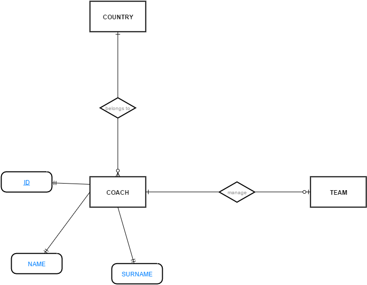
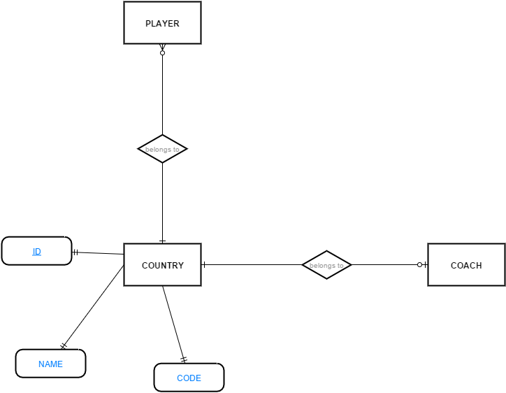
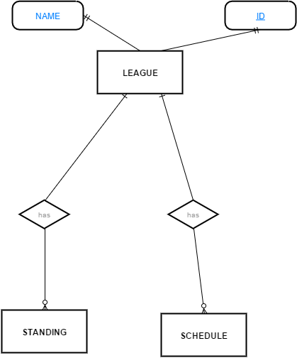
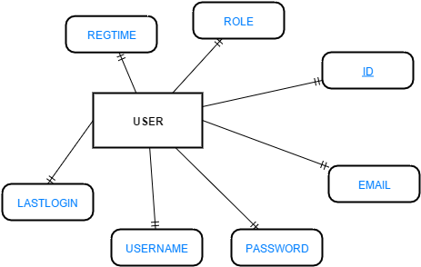
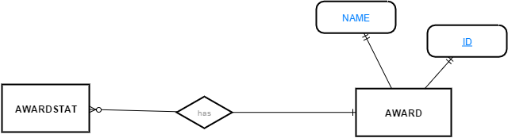
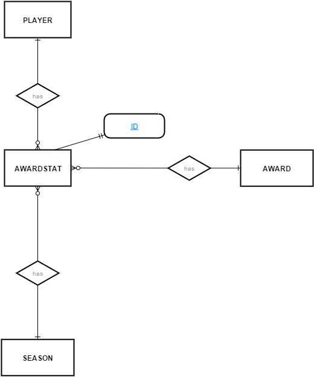
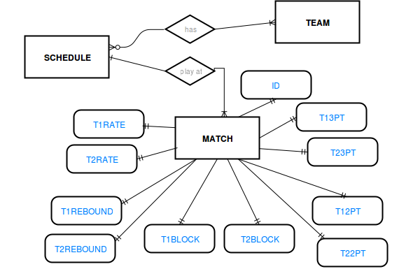
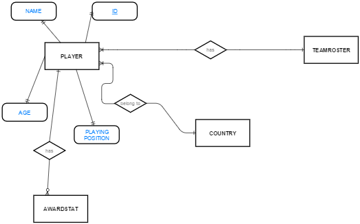
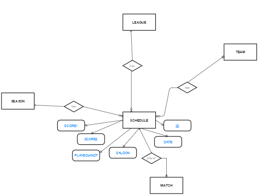
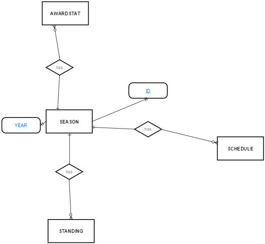
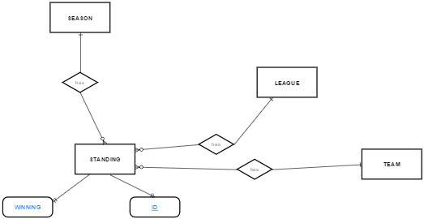
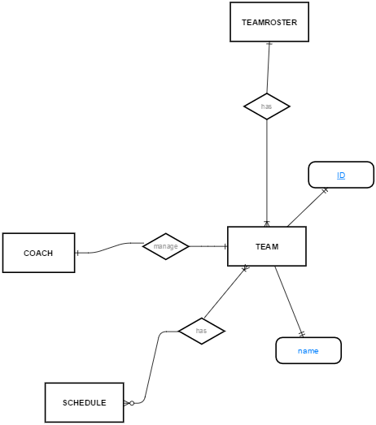
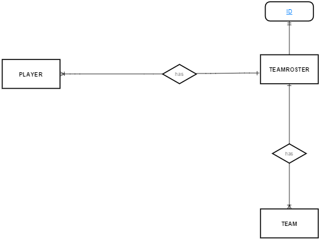

Code
----

Skeleton of the source code
~~~~~~~~~~~~~~~~~~~~~~~~~~~
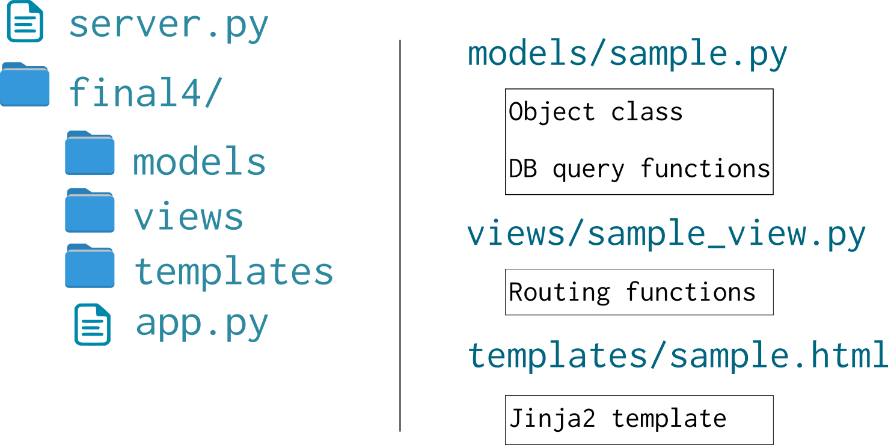
    
  The source code is organized as shown in the diagram to make it easy readable, extandable and maintainable.

.. toctree::

   member1
   member2
   member3
   member4
