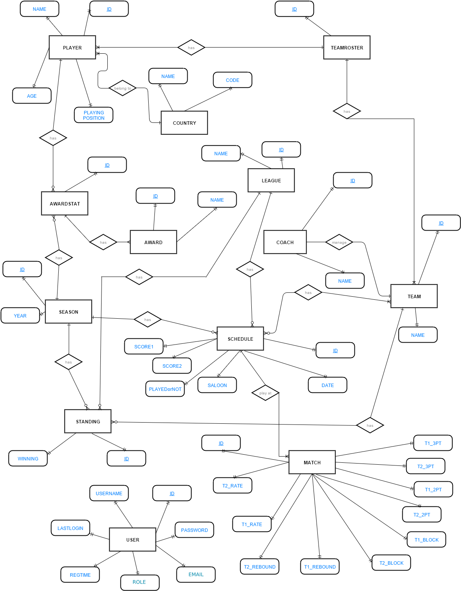

Developer Guide
===============

Database Design
---------------

E/R diagram
~~~~~~~~~~~

**Detailed diagrams also provided below:**

.. image:: diagrams/ER-COUNTRY.png
  :scale: 10 %                    
  :alt: project structure         
.. image:: diagrams/ER-LEAGUE.png 
  :scale: 10 %                    
  :alt: project structure         

.. image:: diagrams/ER-AWARDSTATS.png
  :scale: 10 %
  :alt: project structure

.. image:: diagrams/ER-PLAYER.png
  :scale: 10 %
  :alt: project structure
.. image:: diagrams/ER-SCXHDELU.png
  :scale: 10 %
  :alt: project structure
.. image:: diagrams/ER-SEASON.png
  :scale: 10 %
  :alt: project structure

.. image:: diagrams/ER-TEAM.png
  :scale: 10 %
  :alt: project structure

Code
----

Skeleton of the source code
~~~~~~~~~~~~~~~~~~~~~~~~~~~

    
  The source code is organized as shown in the diagram to make it easy readable, extandable and maintainable.

.. toctree::

   member1
   OSMAN ÖZSOYLU
   member3
   member4
   member5
