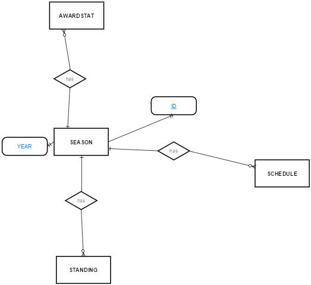
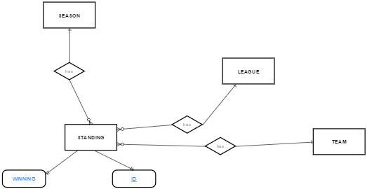
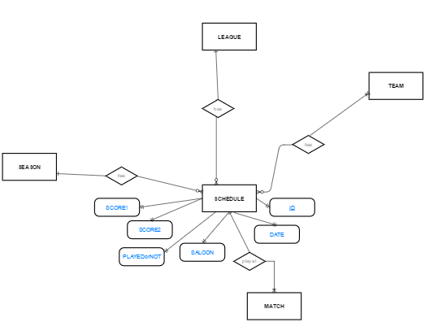

Parts Implemented by Altay İnci
================================

Developer Guide
===============
This page is prepared according to developers.

Database Design
---------------
In this page includes explanations of database designs of season, standing and schedule class with their E/R diagrams.

Season Class
--------------
Season class has two object these are named as **id** which is serial PRIMARY KEY and **year** whose type varchar. This class does not references any object from other classes. However its year object is taken by awardstat, schedule and standing class as in its E/R diagram.

Standing Class
-----------------
Standing class has four object these are named as **id** which is serial PRIMARY KEY, **season_id**, **league_id** and **team_id**. The last three objects' type is integer. 

This class references season_id from season class, references league_id from league class and references team_id from team class. There is no class that reference any object from this class. E/R diagram of standing class is:

- season id for years 
- league id for league names
- team id for team names

      
Schedule Class
-------------------
Schedule class has ten object these are named as **id** which is serial PRIMARY KEY, **team1_id**, **team2_id**, **season_id**, **league_id**, **date**, **saloon**, **score1**, **score2** and **state**.

This class references season_id from season class, league_id from league class and references team1_id, team2_id from team class. Only match class references these class.

- season id for years (integer type)
- league id for league names (integer type)
- team1 id for team names (integer type)
- team2 id for team names (integer type)
- date (timestamp type)
- saloon (varchar type)
- score1 (integer type)
- score2 (integer type)
- state (boolean type)

Codes in Models
-----------------
There are explanations of functionalities of code blocks in project

Season Class
-------------------
   .. code-block:: python

      class Season:
            def __init__(self, year, _id=None):
                self._id = _id
                self.year = year

Code in above, members of season class are initialized.

    .. code-block:: python
    
        class Seasons:
            def add_season(self, season):
                query = """INSERT INTO seasons (year) 
                                    values (%s)"""

Code in above includes function that provides adding of a season item with SQL query.

    .. code-block:: python
    
        def delete_season(self, _id):
            query = """DELETE FROM seasons WHERE id=%s"""
            self.cur.execute(query, (_id,))
            self.conn.commit()

Code in above includes function that provides deletion of a season item with SQL query.

    .. code-block:: python
    
        def update_season(self, _id, new):
            query = """UPDATE seasons SET year=%s
                    WHERE id=%s"""
            self.cur.execute(query, (new.year, _id))
            self.conn.commit()

Code in above includes function that provides update of a season item with SQL query.

    .. code-block:: python

        def get_season(self,_id):
        query = """SELECT * FROM seasons WHERE id=%s"""
        self.cur.execute(query, (_id,))
        l = self.cur.fetchone()
        if l:
            ld = dict(zip(seasontable, l))
            season = Season(ld['year'], ld['id'])
            return season
        else:
            return None

Code in above includes function that provides getting of a season item with SQL query.

    .. code-block:: python
    
        def get_seasons(self):
            query = "SELECT * FROM seasons ORDER BY year;"
            self.cur.execute(query)
            seasons = self.cur.fetchall()
            seasonlist = []
            for l in seasons:
                ld = dict(zip(seasontable, l))
                season = Season( ld['year'],ld['id'])
                seasonlist.append(season)
            return seasonlist

Code in above includes function that provides getting and showing in screen of list of seasons item with SQL query.

    .. code-block:: python
    
        def get_seasons_by(self, key, var):
        
        skey = str(key) + '%'
        query = "SELECT * FROM seasons WHERE year LIKE %s";
        self.cur.execute(query, (skey,))
        seasons = self.cur.fetchall()
        print('seasons:', seasons)
        seasonlist = []
        for c in seasons:
            cd = dict(zip(seasontable, c))
            season = Season(cd['year'], cd['id'])
            seasonlist.append(season)
        return seasonlist

Code in above includes function that provides searching of a season item with SQL query and a key.

Standing Class
--------------------
    .. code-block:: python
    
        class Standing:
            def __init__(self, season_id,league_id,team_id, season_year=None, league_name=None, team_name=None, _id=None):
                self._id = _id
                self.season_id = season_id
                self.season_year = season_year
                self.league_id = league_id
                self.league_name = league_name
                self.team_id = team_id
                self.team_name = team_name

Code in above, members of standing class are initialized.

    .. code-block:: python
    
        class Standings:
            def add_standing(self, standing):
                query = """INSERT INTO standings (season_id,league_id,team_id) 
                                        values (%s,%s,%s)""" 

Code in above includes function that provides adding of a standing item with SQL query.

    .. code-block:: python
        
        def delete_standing(self, _id):
            query = """DELETE FROM standings WHERE id=%s"""
            # variables should be in tuple object
            self.cur.execute(query, (_id,))
            self.conn.commit()

Code in above includes function that provides deletion of a standing item with SQL query.

    .. code-block:: python
    
        def update_standing(self, _id, new):
        
            query = """UPDATE standings SET season_id=%s,league_id=%s,team_id=%s WHERE id=%s"""
            self.cur.execute(query, (new.season_id,new.league_id,new.team_id, _id))
            self.conn.commit()

Code in above includes function that provides update of a standing item with SQL query.

    .. code-block:: python
    
        def get_standing(self,_id):
            query = """SELECT standings.id, seasons.id, seasons.year, leagues.id, leagues.name, teams.id, teams.name
                            FROM standings,seasons,leagues,teams 
                            WHERE standings.id=%s AND seasons.id=standings.season_id AND leagues.id=standings.league_id AND teams.id=standings.team_id"""   
                            
            self.cur.execute(query, (_id,))
            l = self.cur.fetchone()
            if l:
                ld = dict(zip(standingtable, l[:len(standingtable)]))
                standing = Standing(ld['season_id'], ld['league_id'], ld['team_id'], _id=ld['id'], league_name=ld['league_name'],team_name=ld['team_name'],season_year=ld['season_year'])
                return standing
            else:
                return None

Code in above includes function that provides getting of a standing item with SQL query.

.. code-block:: python

    def get_standings(self,limit=100, offset=0):
        query="""SELECT count(standings.id)
                            FROM standings,seasons,leagues,teams WHERE standings.season_id=seasons.id AND standings.league_id=leagues.id AND standings.team_id=teams.id
              """
            self.cur.execute(query)
            total = self.cur.fetchone()[0]
            
            query="""SELECT standings.id, seasons.id,seasons.year,leagues.id,leagues.name,teams.id,teams.name
                            FROM standings, seasons,leagues,teams WHERE seasons.id=standings.season_id AND leagues.id=standings.league_id AND teams.id=standings.team_id
                              LIMIT %s OFFSET %s"""
            self.cur.execute(query, (limit, offset))
            standings = self.cur.fetchall()
            standinglist = []
            for l in standings:
                ld = dict(zip(standingtable, l))
                standing = Standing(ld['season_id'], ld['league_id'], ld['team_id'], _id=ld['id'], league_name=ld['league_name'],team_name=ld['team_name'],season_year=ld['season_year'])
                standinglist.append(standing)
        return standinglist,total

Code in above includes function that provides getting and showing in screen of list of standing items with SQL query.

    .. code-block:: python
        
        def get_standings_search_by(self, attrib, search_key, limit=100, offset=0):
          
            skey = str(search_key) + '%'
          
            query = """SELECT count(standings.id)
                      FROM standings,leagues,teams,seasons
                            WHERE leagues.name LIKE %s AND standings.season_id=seasons.id AND standings.league_id = leagues.id AND standings.team_id = teams.id
                              """
          
            self.cur.execute(query, (skey,))
            total = self.cur.fetchone()[0]
          
            query = """SELECT standings.id, seasons.id, seasons.year, leagues.id,leagues.name, teams.id, teams.name 
                            FROM standings,leagues,teams,seasons
                            WHERE leagues.name LIKE %s AND standings.season_id=seasons.id AND standings.league_id = leagues.id AND standings.team_id = teams.id LIMIT %s OFFSET %s
                      """
            self.cur.execute(query, (skey,limit, offset))
            standings = self.cur.fetchall()
            print('standings:',standings)
            standinglist = []
            for l in standings:
                ld = dict(zip(standingtable, l))
                standing = Standing(ld['season_id'], ld['league_id'], ld['team_id'], _id=ld['id'], league_name=ld['league_name'],team_name=ld['team_name'],season_year=ld['season_year'])
                standinglist.append(standing)
            return standinglist, total

Code in above includes function that provides searching of a standing item with SQL query and a key.

Schedule Class
--------------------

    .. code-block:: python
    
        class Schedule:
            def __init__(self, team1_id, team2_id, season_id, league_id, date, saloon, score1=None, score2=None, state=False, team1_name=None,team2_name=None, season_year=None, league_name=None, _id=None):
             
                self._id = _id
                self.team1_id=team1_id
                self.team2_id=team2_id
                self.season_id = season_id
                self.league_id = league_id
                self.date = str(date)
                self.saloon = saloon
                self.score1 = score1
                self.score2 = score2
                self.state = state
                
                self.team1_name = team1_name
                self.team2_name = team2_name
                self.season_year = season_year
                self.league_name = league_name

Code in above, members of schedule class are initialized.

    .. code-block:: python
    
        class Schedules:
            def __init__(self, conn, cur):
                self.conn = conn
                self.cur = cur
                self.last_key = None

            def add_schedule(self, schedule):
                query = """INSERT INTO schedules (team1_id, team2_id, season_id,league_id,date,saloon,score1,score2,state) 
                                            values (%s,%s,%s,%s,%s,%s,%s,%s,%s)"""

                self.cur.execute(query, (schedule.team1_id, schedule.team2_id, schedule.season_id,schedule.league_id,schedule.date,schedule.saloon,schedule.score1,schedule.score2,schedule.state))
                self.conn.commit()

Code in above includes function that provides adding of a schedule item with SQL query.

        .. code-block:: python

            def delete_schedule(self, _id):
                query = "DELETE FROM schedules WHERE id=%s"
                self.cur.execute(query, (_id,))
                self.conn.commit()

Code in above includes function that provides deletion of a schedule item with SQL query.

    .. code-block:: python
        
        def update_schedule(self, _id, new):
            query = """UPDATE schedules SET team1_id=%s,
                                team2_id=%s,season_id=%s,league_id=%s,date=%s, saloon=%s, score1=%s,score2=%s,state=%s WHERE id=%s"""

                    self.cur.execute(query, (new.team1_id, new.team2_id, new.season_id,new.league_id,new.date,new.saloon,new.score1,new.score2,new.state, _id))
                    self.conn.commit()

Code in above includes function that provides update of a schedule item with SQL query.
    
    .. code-block:: python
        
        def get_schedule(self,_id):
        
            query = """SELECT schedules.id, teams1.id, teams1.name, teams2.id, teams2.name, seasons.id, seasons.year, leagues.id, leagues.name, schedules.date, schedules.saloon, schedules.score1, schedules.score2,schedules.state 
                            FROM seasons,leagues, schedules
                            JOIN teams teams1 ON teams1.id=schedules.team1_id
                            JOIN teams teams2 ON teams2.id=schedules.team2_id
                            WHERE schedules.id=%s AND seasons.id=schedules.season_id AND leagues.id=schedules.league_id
                            """
            self.cur.execute(query, (_id,))
            l = self.cur.fetchone()

            if l:
                ld = dict(zip(scheduletable, l[:len(scheduletable)]))
                schedule = Schedule(ld['team1_id'],ld['team2_id'],ld['season_id'], ld['league_id'], ld['date'], ld['saloon'],ld['score1'],ld['score2'], ld['state'], team1_name=ld['team1_name'], team2_name=ld['team2_name'], season_year=ld['season_year'], league_name=ld['league_name'], _id=ld['id'])
                return schedule
            else:
                return None

Code in above includes function that provides getting of a schedule item with SQL query.
    
    .. code-block:: python
    
        def get_schedules(self, limit=100, offset=0):
                query = """SELECT count(schedules.id)
                            FROM seasons,leagues,schedules 
                            JOIN teams teams1 ON teams1.id=schedules.team1_id
                            JOIN teams teams2 ON teams2.id=schedules.team2_id
                            WHERE seasons.id=schedules.season_id AND leagues.id=schedules.league_id
                              """
                self.cur.execute(query)
                total = self.cur.fetchone()[0]

            query = """SELECT schedules.id, teams1.id, teams1.name, teams2.id, teams2.name, seasons.id, seasons.year, leagues.id, leagues.name, schedules.date, schedules.saloon, schedules.score1, schedules.score2,schedules.state 
                            FROM seasons,leagues,schedules 
                            JOIN teams teams1 ON teams1.id=schedules.team1_id
                            JOIN teams teams2 ON teams2.id=schedules.team2_id
                            WHERE seasons.id=schedules.season_id AND leagues.id=schedules.league_id
			    LIMIT %s OFFSET %s
                            """

            self.cur.execute(query, (limit, offset))
            schedules = self.cur.fetchall()
            schedulelist = []
            for l in schedules:
                ld = dict(zip(scheduletable, l))
                print(l)
                print('-----------------------------------')
                print(ld)
                schedule = Schedule(ld['team1_id'],ld['team2_id'],ld['season_id'], ld['league_id'], ld['date'], ld['saloon'],ld['score1'],ld['score2'], ld['state'], team1_name=ld['team1_name'], team2_name=ld['team2_name'], season_year=ld['season_year'], league_name=ld['league_name'], _id=ld['id'])
                schedulelist.append(schedule)
                
            return schedulelist, total

Code in above includes function that provides getting and showing in screen of list of schedule item with SQL query.

    .. code-block:: python

        def get_schedules_search_by(self, attrib, search_key, limit=100, offset=0):
            # convert search key to special sql search syntax that means
            # all matches that starts with search_key
            # searches team1 attribute
            skey = str(search_key) + '%'
            
            # WARNING !!! SQL INJECTION?
            query = """SELECT count(schedules.id)
                            FROM seasons,leagues,schedules 
                            JOIN teams teams1 ON teams1.id=schedules.team1_id
                            JOIN teams teams2 ON teams2.id=schedules.team2_id
                             WHERE teams1.{attrib} LIKE %s AND seasons.id=schedules.season_id AND leagues.id=schedules.league_id
                              """.format(attrib=attrib)
            self.cur.execute(query, (skey,))
            total = self.cur.fetchone()[0]

            # WARNING !!! SQL INJECTION?
            query = """SELECT schedules.id, teams1.id, teams1.name, teams2.id, teams2.name, seasons.id, seasons.year, leagues.id, leagues.name, schedules.date, schedules.saloon, schedules.score1, schedules.score2,schedules.state 
                            FROM seasons,leagues,schedules 
                            JOIN teams teams1 ON teams1.id=schedules.team1_id
                            JOIN teams teams2 ON teams2.id=schedules.team2_id
                            WHERE teams1.{attrib} LIKE %s AND seasons.id=schedules.season_id AND leagues.id=schedules.league_id
                              LIMIT %s OFFSET %s
                            """.format(attrib=attrib)
            self.cur.execute(query, (skey,limit, offset))
            schedules = self.cur.fetchall()
            print('schedules:', schedules)
            schedulelist = []
            for l in schedules:
                ld = dict(zip(scheduletable, l))
                schedule = Schedule(ld['team1_id'],ld['team2_id'],ld['season_id'], ld['league_id'], ld['date'], ld['saloon'],ld['score1'],ld['score2'], ld['state'], team1_name=ld['team1_name'], team2_name=ld['team2_name'], season_year=ld['season_year'], league_name=ld['league_name'], _id=ld['id'])
                schedulelist.append(schedule)
            return schedulelist, total

Code in above includes function that provides searching of a schedule item with SQL query and a key.

Codes in Views
-----------------
This part includes view codes of project. View codes are like a bridge between **html** and **model** pages.

View of Season Class
-----------------------

    .. code-block:: python
    
        def seasons_home():
            conn, cur = getDb()
            seasons = season.Seasons(conn, cur)
            print('SEASONS PAGE')
            if request.method == 'GET':
                if 'name' in request.args:
                    search_name = request.args['name']
                    l = seasons.get_seasons_by(search_name, 'name')
                    #l = seasons.get_seasons_search_by('name', search_name)
                else:
                    l = seasons.get_seasons()
                return render_template('seasons_home.html', seasontable=season.seasontable, seasons=l)

This code is for providing facilities of showing and searching items to guest user.

    .. code-block:: python
    
        def season_page():
            if 'username' not in session:
                return render_template('error.html', err_code=401)
                
            conn, cur = getDb()
            seasons = season.Seasons(conn, cur)
            print('SEASONS PAGE')
            if request.method == 'GET':
                l = seasons.get_seasons()
                return render_template('seasons.html', seasontable=season.seasontable, seasons=l)
            elif request.method == 'POST':
                year = request.form['year']
                lg = season.Season(year)
                seasons.add_season(lg)
                l = seasons.get_seasons()
                return render_template('seasons.html', seasontable=season.seasontable, seasons=l)

This code is for providing facilities of showing and adding items to admin. If user is not admin, s/he is directed to error page.

    .. code-block:: python
        
        elif request.method == 'DEL':
        print ('DELETE REQUEST:SEASONS PAGE')
        print (request.form)
        # concat json var with '[]' for calling array getted with request
        idlist = request.form.getlist('ids[]')
        print ('IDS: ', idlist)
        if idlist == []:
            try:
                idlist = [request.form['id']]
                print ('IDS: ', idlist)
            except:
                return json.dumps({'status':'OK', 'idlist':idlist})

        print ('IDS: ', idlist)
        print(json.dumps({'status':'OK', 'idlist':idlist}))
        for _id in idlist:
            print (_id)
            seasons.delete_season(_id)
        return json.dumps({'status':'OK', 'idlist':idlist})

This code is for providing facility of deletion to admin.

    .. code-block:: python
        
        def season_from_id(lid):
            if 'username' not in session:
                return render_template('error.html', err_code=401)    
            
            conn, cur = getDb()
            seasons = season.Seasons(conn, cur)
            
            if request.method == 'GET':
                l = seasons.get_season(lid)
                if l:
                    return json.dumps({'status':'OK', 'season':l.getAttrs()})
                else:
                    return json.dumps({'status':'FAILED'})
            elif request.method == 'POST':
                print("PUT METHOD REQUEST")
                lid = request.form['id']
                year = request.form['year']
                
                lg = season.Season(year)
                seasons.update_season(lid, lg)

                l = seasons.get_seasons()
                return render_template('seasons.html', seasontable=season.seasontable, seasons=l)

This code is for providing facility of update to admin.

    .. code-block:: python

        def search_season(key):
            if 'username' not in session:
                return render_template('error.html', err_code=401)
                
            conn, cur = getDb()
            seasons = season.Seasons(conn, cur)
            result = seasons.get_seasons_by(key, 'name')
            return render_template('seasons.html', seasontable=season.seasontable, seasons=result)

This code is for providing facility of searching to admin.

View of Standing Class
-----------------------

    .. code-block:: python
    
        def standing_home():
            conn, cur = getDb()
            standings = standing.Standings(conn, cur)
            seasons = season.Seasons(conn, cur)
            leagues = league.Leagues(conn, cur)
            teams = team.Teams(conn, cur)
            print('STANDINGS PAGE')
            if request.method == 'GET':
                # handle GET request
                print ('GET REQUEST', request.args)
                limit = int(request.args['limit']) if 'limit' in request.args else 10
                page = int(request.args['page']) if 'page' in request.args else 0
                
                offset = page*limit
                print('page:',page,'limit',limit,'offset',offset)
                
                if 'name' in request.args:
                    search_name = request.args['name']
                    l, total = standings.get_standings_search_by('name', search_name, limit=limit, offset=offset)
                else:
                    l, total = standings.get_standings(limit=limit, offset=offset)
            return render_template('standings_home.html', standingtable=standing.standingtable, standings=l, total=total, 
                        limit=limit, page=page)

This code is for providing facilities of showing and searching items to guest user.

    .. code-block:: python
    
        def standing_page():
            if 'username' not in session:
                return render_template('error.html', err_code=401)
            
            conn, cur = getDb()
            standings = standing.Standings(conn, cur)
            seasons = season.Seasons(conn, cur)
            leagues = league.Leagues(conn, cur)
            teams = team.Teams(conn, cur)
            print('STANDINGS PAGE')
            if request.method == 'GET':
                # handle GET request
                print ('GET REQUEST', request.args)
                limit = int(request.args['limit']) if 'limit' in request.args else 10
                page = int(request.args['page']) if 'page' in request.args else 0
                
                offset = page*limit
                print('page:',page,'limit',limit,'offset',offset)
                
         
                standing_list, total = standings.get_standings(limit, offset)
                season_list = seasons.get_seasons()
                league_list,tk = leagues.get_leagues(100,0) # get list object
                team_list,tp = teams.get_teams(100,0)
                
                return render_template('standings.html', standingtable=standing.standingtable, 
			        standings=standing_list, seasons=season_list, leagues=league_list, teams=team_list, 
			        total=total, limit=limit, page=page)
            elif request.method == 'POST':
                print('ADD STANDING')
                season_id = request.form['season_year']
                league_id= request.form['league_name']
                team_id = request.form['team_name']
                limit = int(request.form['limit']) if 'limit' in request.form else 10
                page = int(request.form['page']) if 'page' in request.form else 0
                offset = page*limit
                
                standing_obj = standing.Standing(season_id, league_id, team_id)
                standings.add_standing(standing_obj)
                
                standing_list, total= standings.get_standings(limit,offset)
                season_list = seasons.get_seasons()
                league_list,tk = leagues.get_leagues(100,0)
                team_list,tp = teams.get_teams(100,0)
                
                return render_template('standings.html', standingtable=standing.standingtable, 
			        standings=standing_list, seasons=season_list, leagues=league_list, teams=team_list, 
			        total=total, limit=limit, page=page)

This code is for providing facilities of showing and adding items to admin. If user is not admin, s/he is directed to error page.

    .. code-block:: python
    
        elif request.method == 'DEL':
        # handle DEL request
        print ('DELETE REQUEST:STANDINGS PAGE')
        print (request.form)
        # concat json var with '[]' for calling array getted with request
        idlist = request.form.getlist('ids[]')
        print ('IDS: ', idlist)
        if idlist == []:
            try:
                idlist = [request.form['id']]
                print ('IDS: ', idlist)
            except:
                return json.dumps({'status':'OK', 'idlist':idlist})

        print ('IDS: ', idlist)
        print(json.dumps({'status':'OK', 'idlist':idlist}))
        for _id in idlist:
            print (_id)
            standings.delete_standing(_id) # delete object
        return json.dumps({'status':'OK', 'idlist':idlist})

This code is for providing facility of deletion to admin.

    .. code-block:: python
    
        elif request.method == 'POST':
        print("POST METHOD REQUEST")
        lid = request.form['id']
        season_id = request.form['season_year']
        league_id= request.form['league_name']
        team_id = request.form['team_name']
        
        limit = int(request.form['limit']) if 'limit' in request.form else 10
        page = int(request.form['page']) if 'page' in request.form else 0
        offset = page*limit
        
        standing_obj = standing.Standing(season_id,league_id,team_id)
       
        standings.update_standing(lid,standing_obj)
        
        standing_list, total= standings.get_standings(limit,offset)
        season_list = seasons.get_seasons()
        league_list,tk = leagues.get_leagues(100,0)
        team_list,tp = teams.get_teams(100,0)
        
        return render_template('standings.html', standingtable=standing.standingtable, 
			standings=standing_list, seasons=season_list, leagues=league_list, teams=team_list, 
			total=total, limit=limit, page=page)

This code is for providing facility of update to admin.

    .. code-block:: python
    
        def search_standing(key):
            if 'username' not in session:
                return render_template('error.html', err_code=401)    
            
            conn, cur = getDb()
            standings = standing.Standings(conn, cur)
            seasons=season.Seasons(conn,cur)
            leagues=league.Leagues(conn,cur)
            teams=team.Teams(conn,cur)

            limit = int(request.args['limit']) if 'limit' in request.args else 10
            page = int(request.args['page']) if 'page' in request.args else 0
            
            offset = page*limit
            
            standing_list,total = standings.get_standings_search_by('name', key,  limit, offset)
            season_list = seasons.get_seasons()
            league_list,tk = leagues.get_leagues(100,0)
            team_list,tp = teams.get_teams(100,0)
            
            return render_template('standings.html', standingtable=standing.standingtable, 
			        standings=standing_list, seasons=season_list, leagues=league_list, teams=team_list, 
			        total=total, limit=limit, page=page)
		
This code is for providing facility of searching to admin.

View of Schedule Class
-----------------------

    .. code-block:: python

        def schedule_home():
            conn, cur = getDb()
            schedules = schedule.Schedules(conn, cur)
            teams = team.Teams(conn, cur)
            seasons = season.Seasons(conn, cur)
            leagues = league.Leagues(conn, cur)
            print('SCHEDULES PAGE')
            if request.method == 'GET':
                # handle GET request
                print ('GET REQUEST', request.args)
                limit = int(request.args['limit']) if 'limit' in request.args else 10
                page = int(request.args['page']) if 'page' in request.args else 0
                
                offset = page*limit
                print('page:',page,'limit',limit,'offset',offset)
                sortby = request.args['sortby'] if 'sortby' in request.args else 'name'
                order = request.args['order'] if 'order' in request.args else 'asc'
                
                if 'name' in request.args:
                    search_name = request.args['name']
                    l, total = schedules.get_schedules_search_by('name', search_name, limit=limit, offset=offset)
                else:
                    l, total = schedules.get_schedules(limit=limit, offset=offset)
            return render_template('schedules_home.html', scheduletable=schedule.scheduletable, schedules=l, total=total, 
                        limit=limit, page=page, sortby=sortby)

This code is for providing facilities of showing and searching items to guest user.

    .. code-block:: python

        def schedule_from_id(schedule_id):
            if 'username' not in session:
                return render_template('error.html', err_code=401)    
            
            conn, cur = getDb()
            schedules = schedule.Schedules(conn, cur)
            teams = team.Teams(conn, cur)
            seasons = season.Seasons(conn, cur)
            leagues = league.Leagues(conn, cur)
        if request.method == 'GET':
        # handle GET request
        print ('GET REQUEST', request.args)
        limit = int(request.args['limit']) if 'limit' in request.args else 10
        page = int(request.args['page']) if 'page' in request.args else 0
        
        offset = page*limit
        print('page:',page,'limit',limit,'offset',offset)
        sortby = request.args['sortby'] if 'sortby' in request.args else 'name'
        order = request.args['order'] if 'order' in request.args else 'asc'
 
        schedule_list, total = schedules.get_schedules(limit, offset)
        team_list,tp = teams.get_teams(100,0) # get list object
        season_list = seasons.get_seasons() # get list object
        league_list,tk = leagues.get_leagues(100,0)
        return render_template('schedules.html', scheduletable=schedule.scheduletable, 
			schedules=schedule_list, seasons=season_list, teams=team_list, leagues=league_list,
			total=total, limit=limit, page=page, sortby=sortby)
        elif request.method == 'POST':
        # handle POST request
        print('ADD schedule')
        print (request.form)
        date = request.form['date']
        saloon = request.form['saloon']
        score1 = request.form['score1']
        score2 = request.form['score2']
        state = request.form['state']
        team1_id = request.form['team1_name']
        team2_id = request.form['team2_name']
        league_id = request.form['league_name']
        season_id = request.form['season_year']
        limit = int(request.form['limit']) if 'limit' in request.form else 10
        page = int(request.form['page']) if 'page' in request.form else 0
        offset = page*limit
        order = request.form['sortby'] if 'sortby' in request.form else 'name'
        order = request.form['order'] if 'order' in request.form else 'asc'
        print(team1_id, team2_id,league_id, season_id,date,saloon,score1,score2,state)
        schedule_obj = schedule.Schedule(team1_id, team2_id,season_id, league_id,date,saloon,score1,score2,state)
        schedules.add_schedule(schedule_obj)
        
        schedule_list, total = schedules.get_schedules(limit, offset)
        team_list,tp = teams.get_teams(100,0) # get list object
        season_list = seasons.get_seasons() # get list object
        league_list,tk = leagues.get_leagues(100,0)
        sortby={'attr':'name', 'property':'asc'}
        return render_template('schedules.html', scheduletable=schedule.scheduletable, 
			schedules=schedule_list, seasons=season_list, teams=team_list, leagues=league_list,
			total=total, limit=limit, page=page, sortby=sortby)

This code is for providing facilities of showing and adding items to admin. If user is not admin, s/he is directed to error page.

    .. code-block:: python

        elif request.method == 'DEL':
        # handle DEL request
        print ('DELETE REQUEST:SCHEDULES PAGE')
        print (request.form)
        # concat json var with '[]' for calling array getted with request
        idlist = request.form.getlist('ids[]')
        print ('IDS: ', idlist)
        if idlist == []:
            try:
                idlist = [request.form['id']]
                print ('IDS: ', idlist)
            except:
                return json.dumps({'status':'OK', 'idlist':idlist})

        print ('IDS: ', idlist)
        print(json.dumps({'status':'OK', 'idlist':idlist}))
        for _id in idlist:
            print (_id)
            schedules.delete_schedule(_id) # delete object
        return json.dumps({'status':'OK', 'idlist':idlist})

This code is for providing facility of deletion to admin.

    .. code-block:: python

        if request.method == 'GET':
                # handle GET request
                schedule_obj= schedules.get_schedule(schedule_id)
                if schedule_obj:
                    return json.dumps({'status':'OK', 'schedule':schedule_obj.getAttrs()})
                else:
                    return json.dumps({'status':'FAILED'})
            elif request.method == 'POST':
                # handle POST request
                print("POST METHOD REQUEST")
                schedule_id = request.form['id']
                date = request.form['date']
                saloon = request.form['saloon']
                score1 = request.form['score1']
                score2 = request.form['score2']
                state = request.form['state']
                team1_id = request.form['team1_name']
                team2_id = request.form['team2_name']
                league_id = request.form['league_name']
                season_id = request.form['season_year']
                # limit: number of result showing each page
                # offset: selectedpage x limit
                limit = int(request.form['limit']) if 'limit' in request.form else 10
                page = int(request.form['page']) if 'page' in request.form else 0
                offset = page*limit
                order = request.form['sortby'] if 'sortby' in request.form else 'name'
                order = request.form['order'] if 'order' in request.form else 'asc'
                schedule_obj = schedule.Schedule(team1_id, team2_id, season_id, league_id,date,saloon,score1,score2,state)
                schedules.update_schedule(schedule_id, schedule_obj)
                
                schedule_list, total = schedules.get_schedules(limit, offset)
                team_list,tp = teams.get_teams(100,0) # get list object
                season_list = seasons.get_seasons() # get list object
                league_list,tk = leagues.get_leagues(100,0)
                sortby={'attr':'name', 'property':'asc'}
                return render_template('schedules.html', scheduletable=schedule.scheduletable, 
			        schedules=schedule_list, seasons=season_list, teams=team_list, leagues=league_list,
			        total=total, limit=limit, page=page, sortby=sortby)

This code is for providing facility of update to admin.

    .. code-block:: python

        def search_schedule(key):
            if 'username' not in session:
                return render_template('error.html', err_code=401)
                
            conn, cur = getDb()
            schedules = schedule.Schedules(conn, cur)
            teams = team.Teams(conn, cur)
            seasons = season.Seasons(conn, cur)
            leagues = league.Leagues(conn, cur)

            limit = int(request.args['limit']) if 'limit' in request.args else 10
            page = int(request.args['page']) if 'page' in request.args else 0

            sortby = request.args['sortby'] if 'sortby' in request.args else 'name'
            order = request.args['order'] if 'order' in request.args else 'asc'
            
            offset = page*limit

            schedule_list, total = schedules.get_schedules_search_by('name', key,  limit, offset)
            team_list,tp = teams.get_teams(100,0) # get list object
            season_list = seasons.get_seasons() # get list object
            league_list,tk = leagues.get_leagues(100,0)
            sortby={'attr':'name', 'property':'asc'}
            return render_template('schedules.html', scheduletable=schedule.scheduletable, 
			        schedules=schedule_list, seasons=season_list, teams=team_list, leagues=league_list,
			        total=total, limit=limit, page=page, sortby=sortby)

This code is for providing facility of searching to admin.

