Parts Implemented by Muhammed Yusuf Temiz
=========================================

How to Sign Up
~~~~~~~~~~~~~~
1. Go to top right of the navbar menu and click 'Sign In' link.

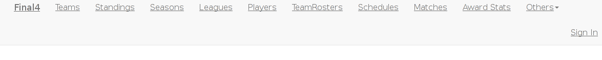

2. Then click Sign Up link that shown in below.

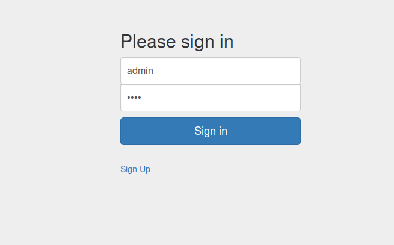

3. After that enter required values for your account and click *Sign Up* button.

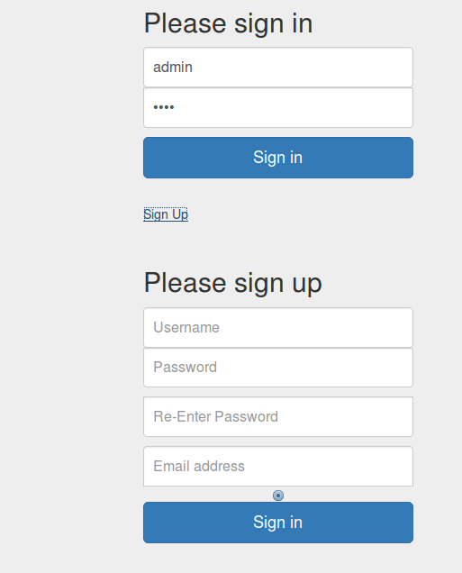


How to Sign In
~~~~~~~~~~~~~~
1. Go to top right of the navbar menu and click 'Sign In' link.


2. Enter your username and password then click *Sign In* button.


Changing Password
~~~~~~~~~~~~~~~~~
After signed in, go to the link from the top-right of the navigation menu and click to the 'My Profile'.

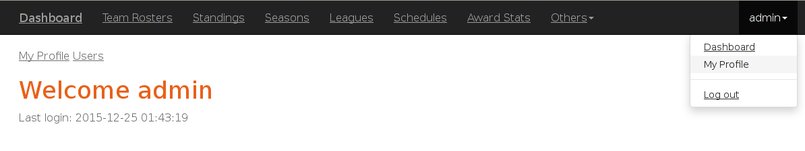

Next you should see below page. Then you can change your password clicking 'Change Password' button.

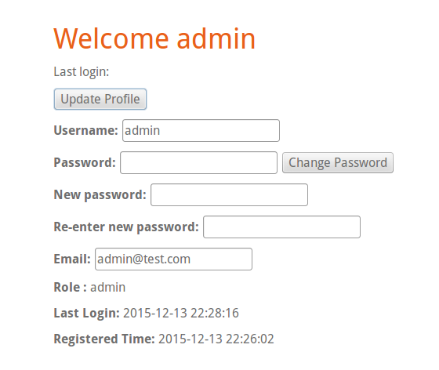

How to add new object to the table
~~~~~~~~~~~~~~~~~~~~~~~~~~~~~~~~~~
**!!!**
**In this section leagues page used as sample page. All steps are the same for leagues, coaches and countries pages.**

1. To edit table values you should signed in first. see `How to Sign In`_

2. Follow links in the navbar go to the table page you want. eg. click *Leagues*
 
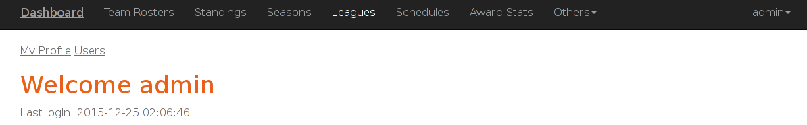

3. After that you should see below page.

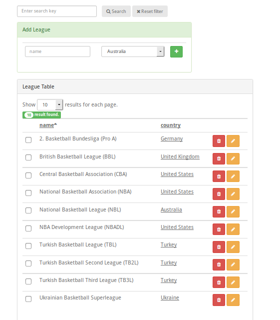

4. To add new League enter league name and select Country from the combobox. Then click green *Add(+)* button.

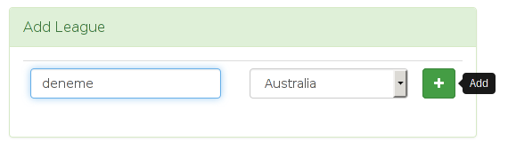

How to update table item value
~~~~~~~~~~~~~~~~~~~~~~~~~~~~~~
**!!!**
**In this section leagues page used as sample page. All steps are the same for leagues, coaches and countries pages.**

1. To edit table values you should signed in first. see `How to Sign In`_

2. Follow links in the navbar go to the table page you want. eg. click *Leagues*
 


3. After that you should see below page.


4. To edit an item first find the item you want then click yellow *Edit(pen icon)* button.

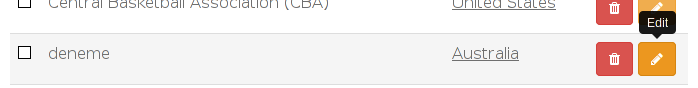

5. Go to bottom of the page then change/enter new values to update the item. After that click Update button.

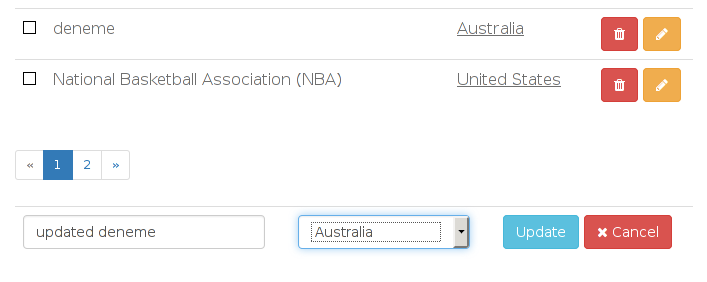

How to delete an item(s) from tables
~~~~~~~~~~~~~~~~~~~~~~~~~~~~~~~~~~~~
**!!!**
**In this section leagues page used as sample page. All steps are the same for leagues, coaches and countries pages.**

1. To edit table values you should signed in first. see `How to Sign In`_

2. Follow links in the navbar go to the table page you want. eg. click *Leagues*
 


3. After that you should see below page.


4. To delete an item first find the item you want then click red *Delete(rubbish icon)* button.

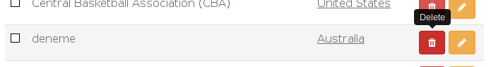

Multiple Deletion
`````````````````

5. To delete multiple items, first select items toggling the checkbox which located right side of the item.

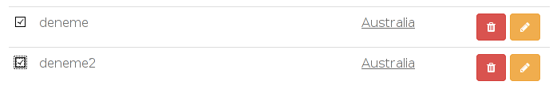

6. Then go to the bottom of the page and click Delete Selected button.

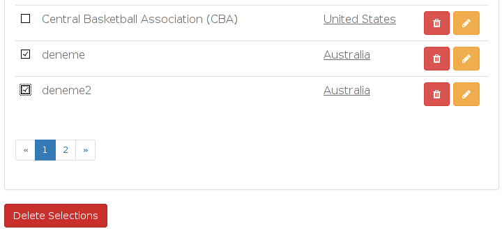

How to search an item
~~~~~~~~~~~~~~~~~~~~~
**!!!**
**In this section leagues page used as sample page. All steps are the same for leagues, coaches and countries pages.**

Search function searches items by only one of its attributes and returns the items that attribute starts with search key.

You can search either signed in or not.


1. Follow links in the navbar go to the table page you want. eg. click *Leagues*
 


2. After that you should see below page.


3. Enter search key to the search box that located head of the page.

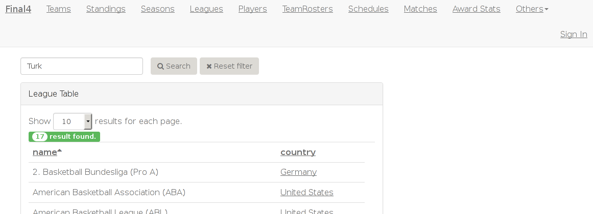

4. Then click the search button to show results. Below page shows the result page after search.

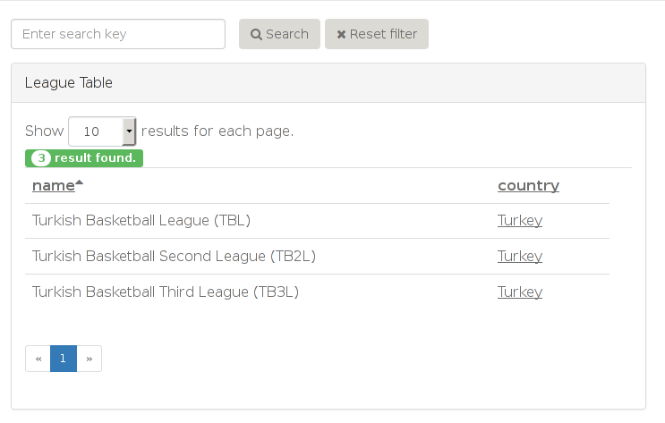

