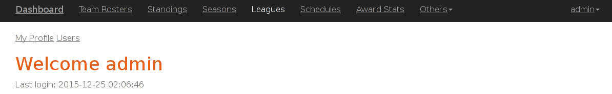

Parts Implemented by Abdullah Buldur
=================================

Insertion new object to the table
***************************************

Awards page is selected as sample. Awardstats and matches pages have same steps.

1. To edit table values you should signed in first. see `How to Sign In`_

2. Follow links in the navbar go to the table page you want. eg. click *Awards*
 

3. After that you should see below page.

4. To add new Award enter award name. Then click green *Add(+)* button.

Update table item value
***********************************

Awards page is selected as sample. Awardstats and matches pages have same steps.

1. To edit table values you should signed in first. see `How to Sign In`_

2. Follow links in the navbar go to the table page you want. eg. click *Awards*
 

3. After that you should see below page.

4. To edit an item first find the item you want then click yellow *Edit(pen icon)* button.

5. Go to bottom of the page then change/enter new values to update the item. After that click Update button.

.. figure:: aa/award_update2.png
  :scale: 70 %
  :alt: Add new award

Deletion an item(s) from tables
***************************************

Awards page is selected as sample. Awardstats and matches pages have same steps.

1. To edit table values you should signed in first. see `How to Sign In`_

2. Follow links in the navbar go to the table page you want. eg. click *Awards*
 

3. After that you should see below page.

4. To delete an item first find the item you want then click red *Delete(rubbish icon)* button.

5. Then go to the bottom of the page and click Delete Selected button.

